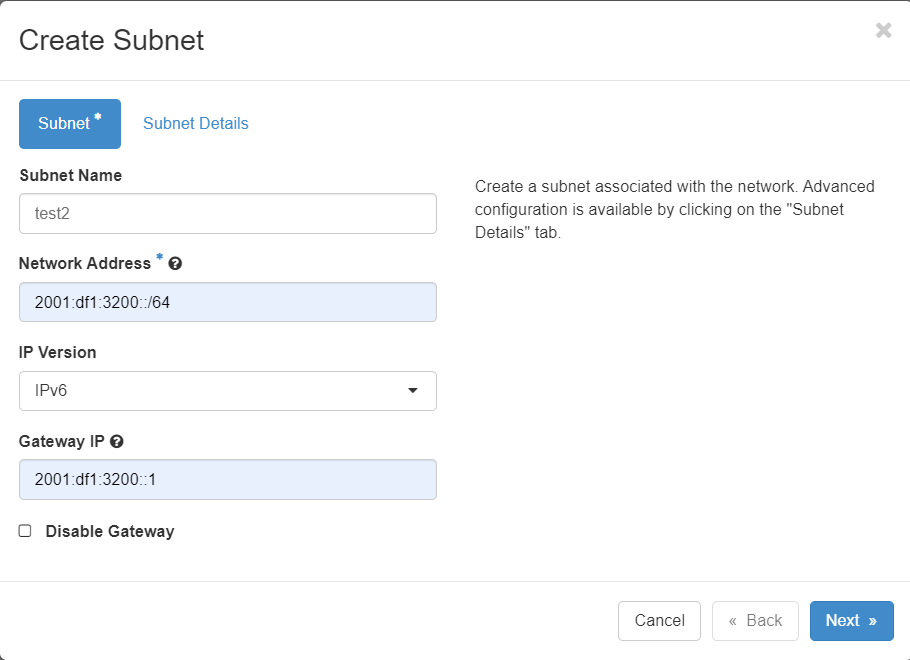
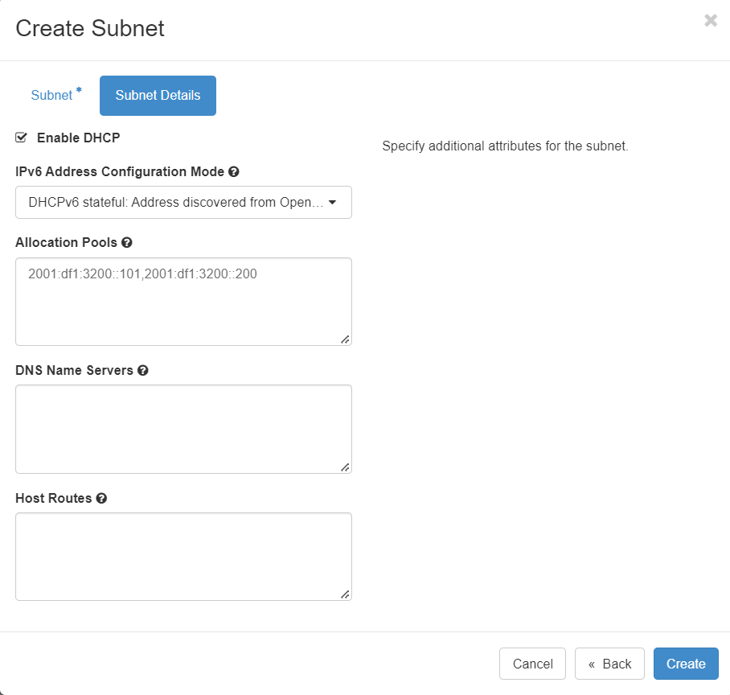

# Hướng dẫn tạo subnet ipv6 trên OpenStack

Lưu ý: Hướng dẫn này sử dụng dual subnet ipv4 vs ipv6

- Tạo subnet IPv4 như bình thường





**Lưu ý:**

- Cần cấu hình RA managed để cấp routing xuống VM nếu sử dụng dhcp statefull trên OPS.
- Các image mặc định thường sẽ chỉ định prefix vì nó không nhận được từ dhcp, ta có thể chỉnh cấu hình prefix qua cloud init như sau (ví dụ trên image cloud centos 7)

```
#cloud-config
password: 'ahihi'
chpasswd: { expire: False }
ssh_pwauth: True
runcmd:
- sudo sed -i '/PATH/i\new_ip6_prefixlen=64' /sbin/dhclient-script
- sudo chmod 646 /etc/sysconfig/network-scripts/ifcfg-eth0
- sudo echo 'NETWORKING_IPV6=yes' >> /etc/sysconfig/network-scripts/ifcfg-eth0
- sudo chmod 644 /etc/sysconfig/network-scripts/ifcfg-eth0
- sudo systemctl restart network
```