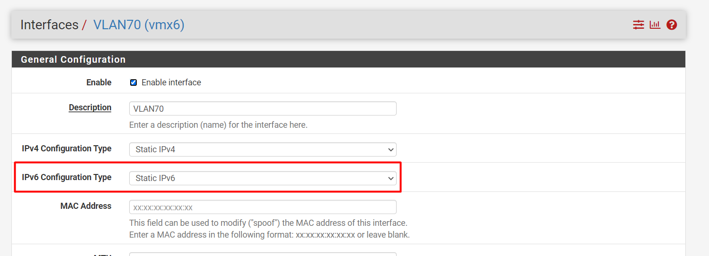
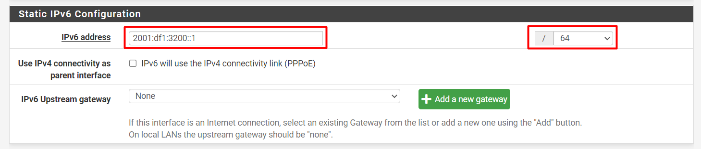
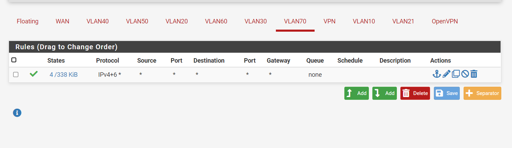
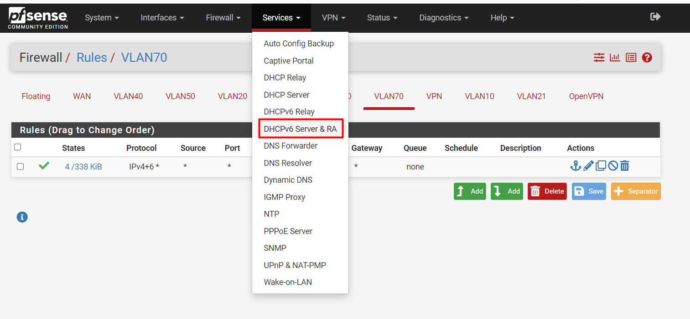
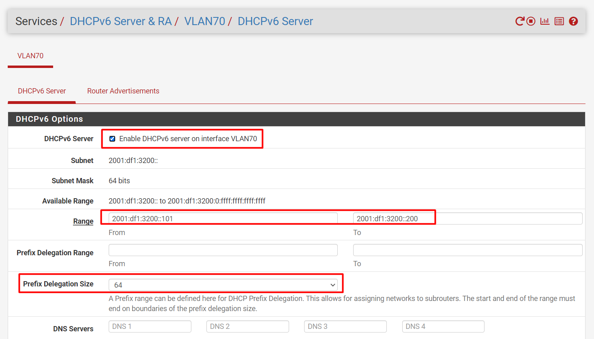
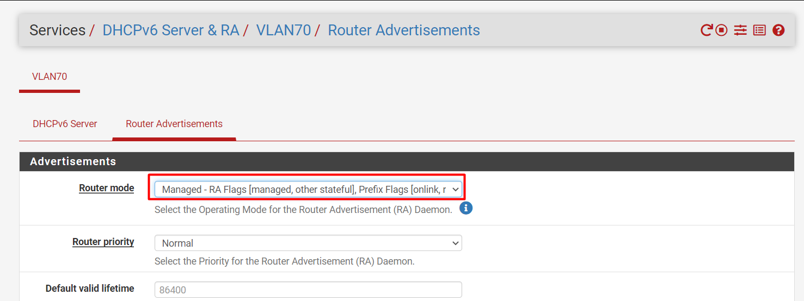
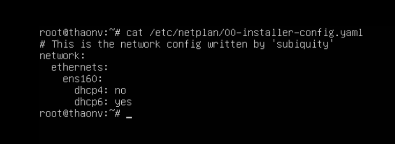
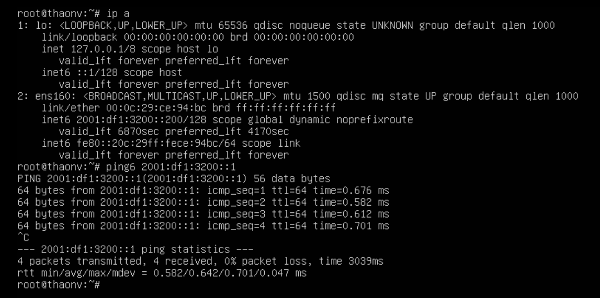
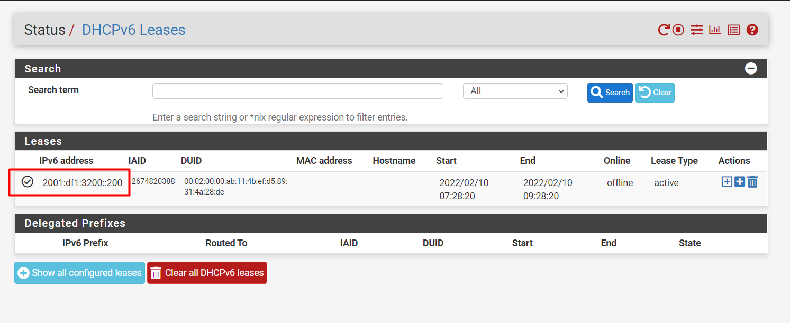

# Hướng dẫn cấu hình cấp DHCP IPv6 với pfsense

**Bước 1: Đặt ipv6 cho interface**  

Sau đó save lại.

**Bước 2: Mở rule cho ipv6 trên interface tương ứng**

**Bước 3: Bật dhcpv6**

**Bước 6: Bật máy ảo dùng dhcp và kiểm tra**

Lưu ý: Cần đảm bảo os đã enable ipv6
Ví dụ ở đây mình sử dụng ubuntu20.04

Cấu hình network như sau:

Lưu ý: Ipv6 không cấp prefix length qua dhcp. Bản tin RA sẽ cung cấp các thông tin về routing.

