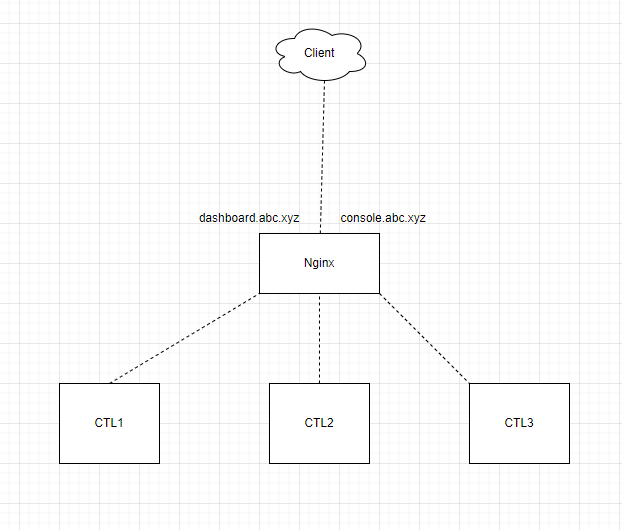

# Hướng dẫn cấu hình Nginx làm proxy cho OpenStack

## 1. Mô hình



- OS Sử dụng Ubuntu 20.04
- Đã có 1 cụm OPS HA 3 node chạy kolla ansible

## 2. Cài đặt Nginx

```
apt update
apt install nginx -y
```

## 3. Cấu hình proxy cho horizon

- Tạo file config `/etc/nginx/conf.d/dashboard.abc.xyz.conf`

```
server {

        listen 80;
        server_name dashboard.abc.xyz;

        location / {
                proxy_set_header X-Real-IP $remote_addr;
                proxy_set_header X-Forwarded-For $proxy_add_x_forwarded_for;
                proxy_set_header Host $host;
                proxy_set_header X-Forwarded-Proto $scheme;
                proxy_pass http://192.168.20.130;
                proxy_http_version 1.1;
    	        proxy_set_header Upgrade $http_upgrade;
    	        proxy_set_header Connection "upgrade";
                proxy_redirect off;
        }
}
```

- Reload config nginx

`nginx -s reload`

## 4. Cấu hình proxy cho novnc

- Tạo file config `/etc/nginx/conf.d/console.abc.xyz.conf`

```
server {

        listen 80;
        server_name console.abc.xyz;

        location / {
                proxy_set_header X-Real-IP $remote_addr;
                proxy_set_header X-Forwarded-For $proxy_add_x_forwarded_for;
                proxy_set_header Host $host;
                proxy_set_header X-Forwarded-Proto $scheme;
                proxy_pass http://192.168.20.130:6080;
                proxy_http_version 1.1;
    	        proxy_set_header Upgrade $http_upgrade;
    	        proxy_set_header Connection "upgrade";
                proxy_redirect off;
        }
}
```

- Reload config nginx

`nginx -s reload`

## 5. Cài đặt certbot

```
apt install certbot -y
apt-get install python3-certbot-nginx -y
```

- Tạo ssl cho dashboard và console

```
certbot --nginx -d dashboard.abc.xyz
certbot --nginx -d console.abc.xyz
```

## 6. Chỉnh sửa file cấu hình của các node compute

- Chỉnh sửa file `/etc/kolla/nova-compute/nova.conf`

```
[vnc]
novncproxy_base_url = https://console.abc.xyz/vnc_auto.html
```

- Restart container `nova-compute`

`docker restart nova_compute`

- Kiểm tra